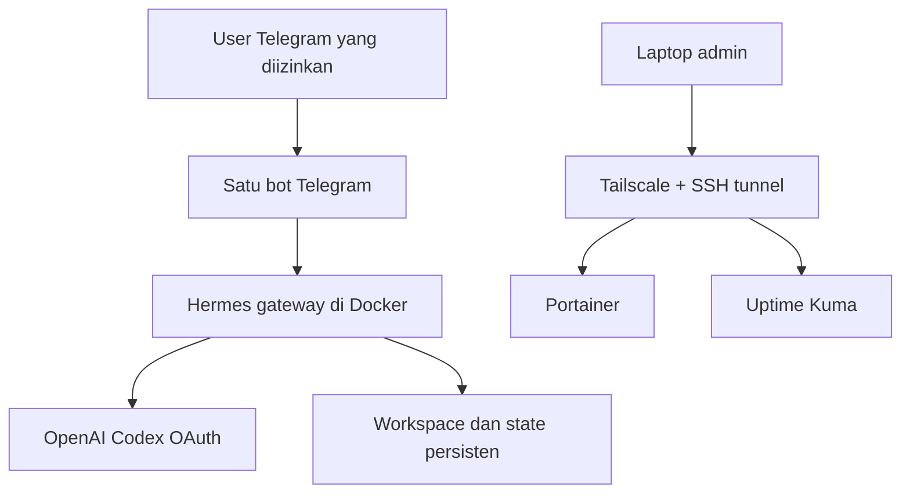

<div align="center">

# Hermes Docker Starter
### One assistant. One Telegram bot. Your configuration.


**Author: thuekx** · Installer interaktif · OpenAI Codex OAuth · Telegram · Portainer · Uptime Kuma · Tailscale

</div>

> [!IMPORTANT]
> Target rekomendasi: **Ubuntu Server 26.04 LTS**, dalam VM khusus atau VPS. Paket ini belum diuji end-to-end pada Ubuntu 26.04 oleh author dalam lingkungan pembuatan ini. Tes offline dan validasi Compose CI disediakan; status pengujian jujur tercatat di [VALIDATION.md](docs/VALIDATION.md). Login OAuth dan tes Telegram wajib diselesaikan sendiri oleh pengguna.

## Apa yang Anda dapatkan

- Instalasi Docker Engine dari repository APT resmi, tanpa `curl | bash`.
- Wizard untuk seluruh nama, direktori, identitas, image, port, token, dan Telegram user ID; contoh **John Doe** / **John AI** hanya contoh.
- Satu container Hermes, satu identitas, satu bot Telegram. Tidak ada menu pemilihan orang, routing persona, atau tambahan bot.
- OpenAI **Codex OAuth** melalui browser resmi; password OpenAI tidak dikumpulkan.
- Portainer CE, Uptime Kuma, dan Tailscale dengan data persisten.
- Image yang dipilih pengguna dikunci ke **registry digest** setelah pull.
- Operasi status, logs, doctor, login ulang, rotasi Telegram, restart, backup, dan panduan restore.
- GPL-3.0-or-later untuk kode installer; kontribusi terbuka.

## Arsitektur



Hermes menjalankan terminal backend `local` **di dalam container Hermes**, dengan workspace `/workspace`. Ini bukan akses terminal Ubuntu host, sandbox worker terpisah, atau akses vCenter. Portainer mempunyai Docker socket untuk mengelola Docker; Hermes dan Kuma tidak. Tailscale menggunakan network host untuk akses privat ke server, bukan subnet router/exit node.

## Mulai dari server kosong

### 1. Siapkan Ubuntu dan ambil repository

Rekomendasi awal: 2–4 vCPU, RAM 4–8 GB, disk lokal 30 GB atau lebih; browser/tool berat membutuhkan kapasitas tambahan. Gunakan ext4/XFS lokal, SSH dari laptop, user Ubuntu biasa dengan sudo, dan SSH key. Nama user/password OS dipilih di installer Ubuntu; tool ini tidak membuat atau mengganti akun OS.

```bash
sudo apt-get update
sudo apt-get install -y git python3 ca-certificates curl
read -r -p 'Nama folder clone (contoh: john-ai-installer): ' CLONE_DIR
git clone -- https://github.com/thuekx/hermes-docker-starter.git "$CLONE_DIR"
cd -- "$CLONE_DIR"
```

Untuk salinan ZIP: ekstrak lalu buka terminal di folder yang berisi `install.sh`. Baca source sebelum menjalankan skrip dengan sudo.

### 2. Instal Docker

```bash
sudo bash scripts/install-docker.sh
```

Bootstrap ditargetkan Ubuntu **26.04**. Docker lama yang valid dipertahankan. Paket konflik menyebabkan proses berhenti, bukan dihapus diam-diam. Docker group tidak otomatis diberikan karena anggota grup dapat mengendalikan host seperti root. Script memakai `sudo docker` bila akses Docker user biasa tidak tersedia.

### 3. Siapkan satu bot dan jalankan wizard

1. Buka [@BotFather](https://t.me/BotFather) resmi; kirim `/newbot`.
2. Isi nama sendiri, contoh **John AI**; username unik harus berakhiran `bot`.
3. Simpan token privat. Ambil **Telegram user ID akun manusia**, bukan ID bot atau username. Bisa memakai `@userinfobot` dengan menyadari itu layanan pihak ketiga; alternatif resmi `getUpdates` dijelaskan di [CONFIGURATION.md](docs/CONFIGURATION.md).
4. Jangan menjalankan bot/token yang sama di gateway lain. Untuk instalasi baru paling disarankan buat bot baru.

```bash
bash install.sh
```

Wizard menanyakan identitas, konfigurasi, dan token tersembunyi. Tidak ada nama dari mesin author, direktori home author, atau token author. Data disimpan di direktori **baru** yang Anda pilih di luar clone Git. Direktori lama ditolak agar state yang sedang dipakai tidak tertimpa.

Contoh referensi image saat wizard meminta **input manual**:

| Komponen | Referensi contoh | Kebijakan |
|---|---|---|
| Hermes | `nousresearch/hermes-agent:latest` | Gunakan versi/digest yang sudah Anda uji; moving tag akan dipin setelah pull |
| Portainer CE | `portainer/portainer-ce:lts` | Pin digest hasil pull |
| Uptime Kuma | `louislam/uptime-kuma:2` | Pin digest hasil pull |
| Tailscale | `tailscale/tailscale:stable` | Pin digest hasil pull |

Riwayat konfigurasi sukses menggunakan Hermes v0.21.5 / 2026.9.24 dengan image `latest`. **Jangan menganggap `latest` hari ini sama dengan image riwayat itu.** Tag versi Docker riwayat belum diverifikasi; installer tidak mengarang tag yang belum terbukti tersedia.

### 4. OAuth OpenAI, Portainer, dan Kuma

Installer membuka wizard `hermes model` di container one-shot, setelah gateway dihentikan:

1. Pilih **ChatGPT or Codex Subscription / OpenAI Codex**.
2. Buka URL resmi yang diberikan di browser; masukkan device code dan login ke akun sendiri.
3. Pilih model Codex yang benar-benar tersedia pada akun. Model tidak dipatok ke nama yang mungkin sudah berubah.
4. Tes inference harus membalas `HERMES OPENAI OAUTH OK`. Jawab `y` hanya setelah melihat respons model.
5. Buka URL Portainer dan Kuma memakai **SSH tunnel yang dicetak installer**, dari laptop.
6. Buat username dan password admin **sendiri dalam UI masing-masing**. Tidak ada password default; akun ini tidak dibuat otomatis lewat API yang tidak stabil.
7. Bila Portainer meminta setup token, baca logs **secara lokal** memakai `python3 scripts/manage.py logs portainer`. Jangan menyalin token/log mentah ke issue publik.
8. Pilih local Docker di Portainer, lalu buat monitor mengikuti [MONITORING.md](docs/MONITORING.md).

> [!WARNING]
> Jangan memilih Claude/Anthropic sebagai model `openai-codex`. Jangan menggunakan `hermes setup --portal` untuk alur OpenAI ini: Nous Portal merupakan provider berbeda. OAuth tidak otomatis memberikan API key untuk web search, image generation, TTS, atau integrasi eksternal. Aktifkan tool berbayar/integrasi tambahan secara manual melalui `hermes tools` sesuai kebutuhan; satu bot tetap digunakan.

### 5. Tailscale

Installer menjalankan `tailscaled` dalam container lalu `tailscale up`. Login melalui URL resmi yang tampil, pilih tailnet Anda, dan verifikasi node. Tidak ada auth key permanen di file installer.

Pasang Tailscale di laptop/ponsel, masuk tailnet yang sama, lalu gunakan IP Tailscale yang dicetak sebagai target SSH tunnel. **Panel tetap di `localhost`**; membuka `http://IP_TAILSCALE:3001` langsung memang tidak bekerja. Lihat [ACCESS.md](docs/ACCESS.md).

Jangan aktifkan Funnel atau membagikan seluruh tailnet untuk panel admin. Batasi grant/ACL Tailscale agar hanya administrator dapat mengakses SSH server.

### 6. Telegram dan acceptance

Kirim ke bot Anda:

```text
/start
Balas persis: TELEGRAM OK
/sethome
Buat file /workspace/hello.txt berisi Hello, lalu baca kembali isinya.
```

`/sethome` opsional untuk tujuan notifikasi/scheduled job. Bot menjawab sebagai identitas yang Anda isi, tanpa pilihan orang. Tes file memastikan tool bekerja dalam container. Konfirmasi Telegram di installer hanya setelah bot benar-benar membalas.

```bash
python3 scripts/manage.py status
python3 scripts/manage.py doctor
python3 scripts/manage.py logs hermes
```

**Selesai** bila OAuth inference, balasan Telegram, allowlist, workspace, persistence restart, akses panel, dan Tailscale lulus. Ikuti [checklist acceptance](docs/VALIDATION.md). Container `running` sendiri belum membuktikan bot/model sehat.

## Operasi sehari-hari

| Kebutuhan | Perintah |
|---|---|
| Lanjutkan instalasi terputus | `bash install.sh` — konfigurasi awal dipertahankan, wizard/login akan dijalankan lagi |
| Status stack | `python3 scripts/manage.py status` |
| Logs komponen | `python3 scripts/manage.py logs hermes` / `portainer` / `kuma` / `tailscale` |
| Diagnosis Hermes | `python3 scripts/manage.py doctor` |
| Login/pilih model ulang | `python3 scripts/manage.py login`, lalu `python3 scripts/manage.py start` |
| Login Tailscale ulang | `python3 scripts/manage.py tailscale-login` |
| Ganti token dan allowlist | `python3 scripts/manage.py rotate-telegram` |
| Restart baca konfigurasi baru | `python3 scripts/manage.py restart hermes` |
| Stop/start seluruh stack | `python3 scripts/manage.py stop` / `start` |
| Backup konsisten | `python3 scripts/manage.py backup` |
| Cetak akses panel | `python3 scripts/manage.py access` |
| Validasi Compose | `python3 scripts/manage.py validate` |

Panduan [backup, restore, upgrade](docs/OPERATIONS.md), [error & perbaikan](docs/TROUBLESHOOTING.md), dan [security do/don't](SECURITY.md).

## Do / Don't / Paling disarankan

| Do ✅ | Don't ❌ | Paling disarankan ⭐ |
|---|---|---|
| Input nama, user ID, image, dan path sendiri | Salin token/password orang lain | VM Ubuntu 26.04 khusus untuk agent |
| Batasi `TELEGRAM_ALLOWED_USERS` | Aktifkan allow-all | Satu bot baru dan satu gateway aktif |
| Uji login + inference + pesan Telegram | Anggap OAuth sukses hanya karena file auth ada | Acceptance sebelum pemakaian rutin |
| Akses panel dengan SSH tunnel/Tailscale | Bind panel ke `0.0.0.0` lalu hanya mengandalkan UFW | Localhost + ACL tailnet |
| Pin digest, backup sebelum update | Auto-update tanpa tes atau menghapus data saat error | Update manual di clone/VM uji |
| Batasi file/akses yang diberikan agent | Mount `/`, Docker socket, atau credential production ke Hermes | Workspace khusus dan akses minimum |
| Jaga OAuth, bot token, dan backup privat | Commit `.runtime`, state, `.env`, logs, backup | Enkripsi backup dan rotasi token bocor |

## Kontribusi & upload GitHub

**Contributors welcome!** Baca [CONTRIBUTING.md](CONTRIBUTING.md). Panduan upload tanpa membocorkan runtime ada di [GITHUB.md](docs/GITHUB.md). Repository ini tidak menyertakan token atau akun siap pakai. Source tersedia di [thuekx/hermes-docker-starter](https://github.com/thuekx/hermes-docker-starter).

Kode original installer © 2026 **thuekx**, GPL-3.0-or-later. Hermes dan aplikasi lain tetap memakai lisensi upstream masing-masing; lihat [NOTICE.md](NOTICE.md).

Referensi resmi dan tanggal pemeriksaan: [SOURCES.md](docs/SOURCES.md).
